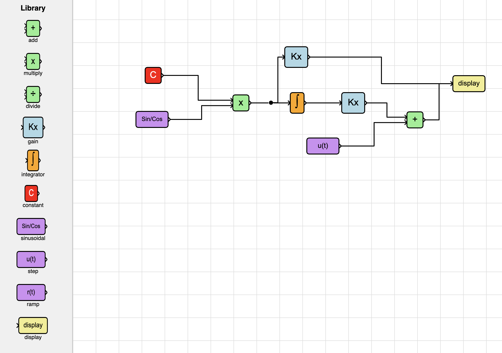

# QuickSim

QuickSim is a minimalistic and humble attempt to create a simplified clone of Simulink. Its goal is to enable users to build, solve, and analyze dynamic models using a block-based programming paradigm, with plans for interactive visualization. Contributions and support are welcome.

